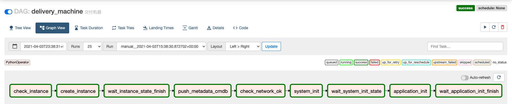

# Airflow
> 此 repo 为 airflow 的 dags 目录


## 安装

```bash
# cd /
# git clone git@github.com:zhengyansheng/lightning-airflow.git
# cd lightning-airflow
```

```bash
# python3.6 -m venv .venv
# source .venv/bin/activate
# pip install -U pip
# pip install -r requirements.txt --timeout 300
```

```bash
# export PYTHONPATH=$PYTHONPATH:/root/lightning-airflow:/root/airflow
```

## 启动

- 启动 Web
```bash
# airflow webserver -p 8000
```

- 启动 Scheduler
```bash
# airflow scheduler
```

- 启动 Worker
```bash
# airflow celery worker
```

## 案例

### 主机交付




[airflow 后台地址](http://www.aiops724.com:8888/)

帐号: admin

密码: zhengyansheng

## 学习交流


**群已满，无法自动扫码入群，扫个人微信单独发邀请入群，备注 airflow**


## 文档

- [github apache-airflow](https://github.com/apache/airflow)
- [airflow document](https://airflow.apache.org/docs/apache-airflow/stable/start/index.html)